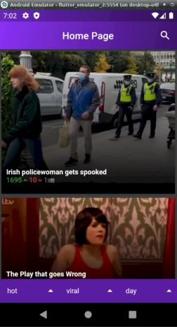

# Documentation Epicture

Ceci est la documentation technique officielle du projet **Epicture** proposé par **EPITECH**.

Il nous est demandé de réaliser par groupes de 2, une application mobile utilisant l'**API imagur**.

Pour réaliser ce projet nous avons décidé d'utiliser comme technologie le langage **Flutter**.

Nous n'aborderons pas la partie du développement de l'application pour Apple.
___

## I - Technologies et Logiciels

Avant de pouvoir tester et travailler sur l'application, il vous faudra installer ces différents outils.

Pour commencer, installez flutter via le site officiel.

Maintenant, il vous faut installer **Android Studio**. En installant ce logiciel, cela vous installera tous les packages nécessaires au développement d'applications pour android. De plus, il vous donnera accès à des émulateurs de téléphone ou de tablette sous android pour pouvoir directement tester votre application sans utiliser votre téléphone.

Si vous voulez tester ou développer votre application directement sur votre téléphone, il vous faudra passer en **mode développeur** et activer le **mode débogage** quand vous serez branché par USB.

Pour utiliser flutter simplement, vous pouvez installer **l'extension Flutter** sur **Visual Studio Code**. Cela vous permettra aussi du compiler rapidement sous un émulateur d'**Android Studio** et de débugger en temps réel votre application à chaque sauvegarde du code.

___

## II - Architecture
___

1 - Architecture des dossiers
===
Vous aurez ici toutes les informations sur la disposition des dossiers et sur les fichiers les plus importants.

    epicture
    ├─android // Ce dossier gère la partie Android de l'application
    │ └─app
    │   └─src
    │     └─main
    │       ├─mipmap-hdpi // Inclure une image nommée "ic_launcher.png" aux bonnes dimension qui sera l'icon de l'application (idem pour les dossiers similaires)
    │       │ └─ic_launcher.png
    │       ├─mipmap-mdpi // //
    │       ├─mipmap-xhdpi // //
    │       ├─mipmap-xxhdpi // //
    │       ├─mipmap-xxxhdpi // //
    │       └─AndroidManifest.xml // Doit être modifié directement pour l'ajout de certains paramètres spécifiques à Android
    ├─build
    │ └─app
    │   └─outputs
    │     └─app-release.apk // c'est ici que l'APK sera disponible une fois son build
    ├─ios // Ce dossier gère la partie IOS de l'application
    ├─lib
    │ ├─pages // Contient les différentes pages que possède l'application
    │ ├─parsers // Contient les parsers de Json
    │ ├─providers // Contient les différents providers de l'application
    │ ├─widgets // Contient les widgets customs ou modifié
    │ └─main.dart // Contient la fonction de lancement ainsi que certain paramètre de l'application
    ├─test // L'ajout de test de l'application ce fait dans ce dossier
    └─pubspec.yaml // L'ajout de nouveau plugin ce fait dans ce fichier dans les dependencie

___
2 - Architecture des Pages
===
Vous aurez ici toutes les informations sur les fonctions des différentes pages.

StartPage :

Page de lancement de l'application. Il y a un bouton login pour pouvoir se connecter à l'application.

    void waitLoginResult() async // redirige l'utilisateur sur la LoginPage si il ne s'est pas déjà connecté et sur HomePage si il s'est déjà connecté

LoginPage :

Page de connexion pour l'utilisateur sous forme de web view (le site officiel de imagur).

    void initState() // envoie l'utilisateur sur la page web de connexion de imagur. Enregistre les informations de l'utilisateur une fois la connexion réussite
    void dispose() // écoute le changement d'url

HomePage :

Page d'accueil de l'application affichant tous les postes séléctionnés en fonction des tags et des recherches effectuées par l'utilisateur.
On peut aller se rendre sur AccountPage en appuyant sur l'avatar de l'utilisateur ou aller sur ImageDetailsPage pour avoir plus d'informations sur le poste sélectionné si on appuie sur le poste en question

    void getAccountAvatar() // requête pour récupérer l'avatar de l'utilisateur
    void getGalleryImageWithoutSearchQuery() // requête pour récupérer les postes en fonction des tags sélectionné
    void getGalleryImageWithSearchQuery() // requête pour récupérer les postes en fonction des tags selectionnés et du texte enregistré dans la barre de recherche
    void initState() // appelle la fonction getGalleryImageWithoutSearchQuery() ou getGalleryImageWithSearchQuery()

ImageDetailsPage :

Page montrant le poste en intregral. On a la possibilitée de up vote et down vote, de mettre le poste en favoris et pour finir on peut glisser le doigt sur le côté pour voir les différentes images du post.

    void initState() // requête pour  obtenir les différentes informations de la publication. Une autre requête est effectuée pour savoir si le poste est déjà en favoris
    void favoriteImage(MyImage imageData) // requête pour mettre ou enlever des favoris

AccountPage :

Page affichant les différents postes de l'utilisateur et permettant aussi d'aller sur les pages FavoritePage et UploadPage.

    void initState() requête pour récupérer les différents postes de l'utilisateur

UploadPage :

Page pouvant servir à l'utilisateur de publier ses posts.

    Future getImageFromCamera() async // Ouvre la caméra de l'appareil et sauvegarde la photo prise dans une variable
    Future getImageFromFile() async // Ouvre la galerie de l'appareil et sauvegarde la photo sélection dans une variable
    void tryToUploadNewPost() // requête pour poster l'image si les différentes conditions sont remplies. Redirige vers HomePage en cas de succès
    void dispose() // écoute les changements de texte dans des champs title et description

FavoritePage :

Page affichant tous les favoris de l'utilisateur

    void initState() // fait la requête pour récupérer les favoris

___
3 - Architecture des données
===
Vous trouverez ici toutes les informations sur la structure des providers.

UserInfo :

    String accessToken;
    int expiresIn;
    String refreshToken;
    String accountUsername;
    int accountID;
    String avatarUrl = "";
    String querySearchImage = "";
    ImageList favoriteImages;

    String _parseURLKey(String url, String key) // Récupère les infos dans l'url passée en paramètre
    void logUser(String url) // remplit le provider des infos de l'utilisateur
    void getAvatar(String url) // récupère l'avatar de l'utilisateur
    void getQuerySearchImage(String query) // récupère le contenu de la barre de recherche
    void logoutUser() // réinitialise les providers quand l'utilisateur se déconnecte

Parseurs de données:
___
## III - Build APK

Pour obtenir un APK, il va falloir exécuter ces commandes à la suite.

    $> flutter clean
    $> flutter pub get
    $> flutter build

Pour trouver le fichier APK, referez-vous à la partie (II - 1).
___

**by Thomas DALEM / Tony MARINI**