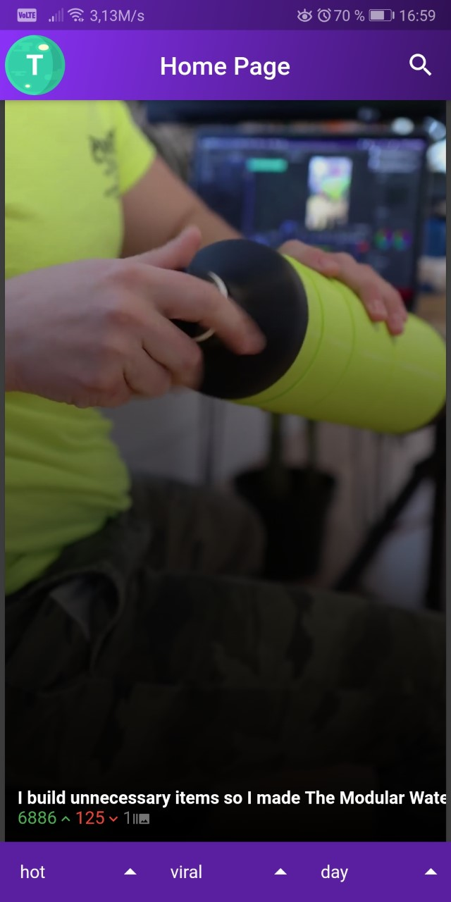
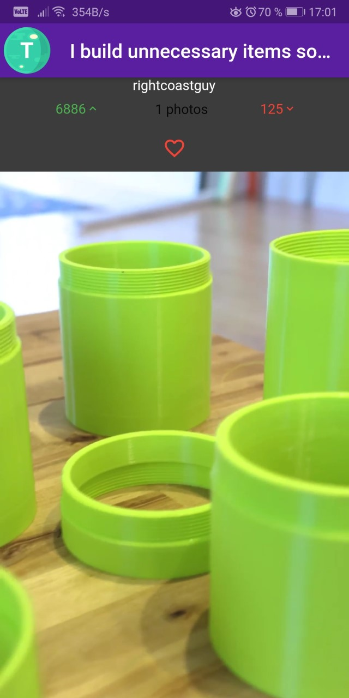

# Epicture

## Project Description
Epitech 3rd year project where the goal was to create a **mobile application** to see posted photos and videos on **Imgur**.
Our project was made with **Flutter**, and is using the **Imgur API**.

With this app you can:
- See photos, GIFs and videos.
- View the comments of a post.
- Upvote, Downvote and Favorite a post.
- See your favorite posts.
- Upload a post with a title and a description

## Project Screenshots

